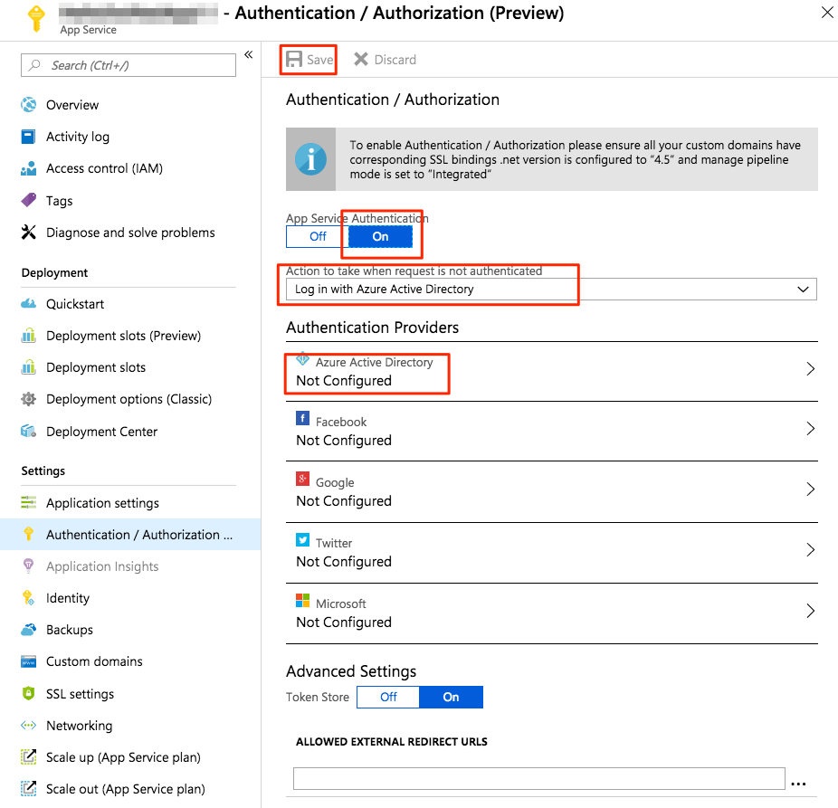
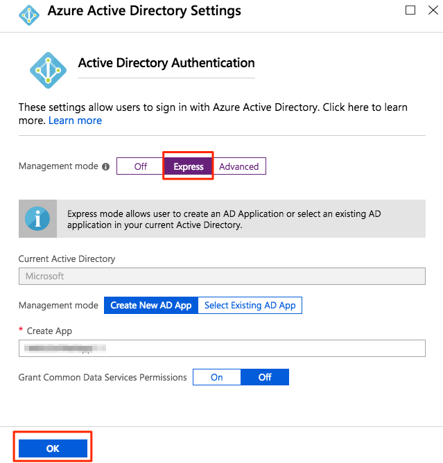
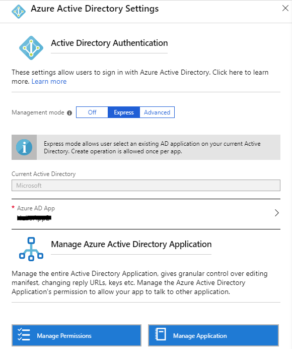
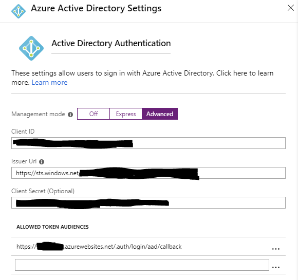
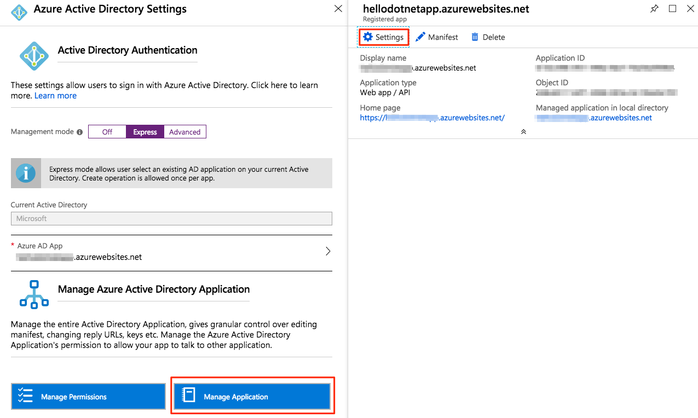

# Configure Azure Active Directory for Web Portal

After deployment, you need to configure [Azure Active Directory](https://docs.microsoft.com/en-us/azure/active-directory/fundamentals/active-directory-whatis)(aka. Azure AD, AAD) for the HPC ACM Web Portal to work with authentication. You can do this either by running a PowerShell script or by manual configuration in Azure Web Portal. Either way, you effectively create an Azure AD app and associate it with the HPC ACM Web Portal, which is an app of [Azure App Service](https://docs.microsoft.com/en-us/azure/app-service/). You will need the "client id", "client secret" and "issuer url" from the Azure AD app to use [HPC ACM CLI](https://github.com/Azure/hpcpack-acm-cli). The following sections show you how.

## Way One: PowerShell Script

You need a PowerShell environment to run the script. The easiest way is to use the [PowerShell on Azure CloudShell](https://shell.azure.com/powershell). If you're using a PowerShell in your computer, make sure you have installed PowerShell modules `AzureRM` and `AzureAD`.

The script to run is https://raw.githubusercontent.com/Azure/hpcpack-acm/app-service/src/deployment/SetupAAD.ps1. Save it as file `SetupAAD.ps1` to the PowerShell environment you choose. In CloudShell, you could do it by

```
curl https://raw.githubusercontent.com/Azure/hpcpack-acm/app-service/src/deployment/SetupAAD.ps1 -o SetupAAD.ps1
```

Execute `./SetupAAD.ps1 -?` shows the parameters:

```
SetupAAD.ps1 [-SubscriptionId] <string> [-ResourceGroupName] <string> [-WebAppName] <string> [<CommonParameters>]
```

There're three required parameters:
* SubscriptionId: The id of Azure Subscription in which the Web App for the HPC ACM Web Portal lives
* ResourceGroupName: The name of the resource group in which the Web App lives
* WebAppName: The name of the Web App for HPC ACM Web Portal

When the execution of script succeeds, it returns a hash object with three properties: `IssuerUrl`, `ClientId` and `ClientSecret`. Save them properly for use of the HPC ACM CLI.

## Way Two: Configuration in Azure Web Portal

You need to log into the [Azure Web Portal](https://portal.azure.com) and navigate to the Web App for the HPC ACM Web Portal. Then select "Authentication / Authorization" under "Settings" and make changes as the followings:



The points are:
* Turn on "App Service Authentication"
* Select "Log in with Azure Active Directory" for "Action to take when request is not authenticated"
* Select and open "Azure Active Directory" for "Authentication Providers" for further configuration
* Don't forget to "Save" after all

Here's the further configuration when you opened "Azure Active Directory" for "Authentication Providers":



The points are:
* Select "Express" for "Management mode"
* Select "OK"

Again, don't forget to "Save" on "Authentication / Authorization" page after all of these changes.

Note: if you want to use HPC ACM CLI, you need to figure out "client id", "client secret" and "issuer url" from the Azure AD app. The next section shows you how.

## Manage Azure Active Directory App

You may want to do some management work on the Azure AD app. For example, you need to get "client id", "client secret" and "issuer url" for use of HPC ACM CLI, or you need to limit the access to the HPC ACM Web Portal to a given set of members in your organization. You can do the management work by Azure web portal.

Firstly, navigate to the Web App for the HPC ACM Web Portal. Then select "Authentication / Authorization" under "Settings" as above section shows. Then click and open the "Azure Active Directory" from the list of "Authentication Providers". It will show an UI similar to the following:



Select "Advanced" from the "Management mode", it will show the "client id", "client secret" and "issuer url":



Back to the "Express" mode, and click on the button "Manage Application", a page for settings of the Azure AD app will show:



From there, you have do more management work, or explore more options to the Azure AD app.
